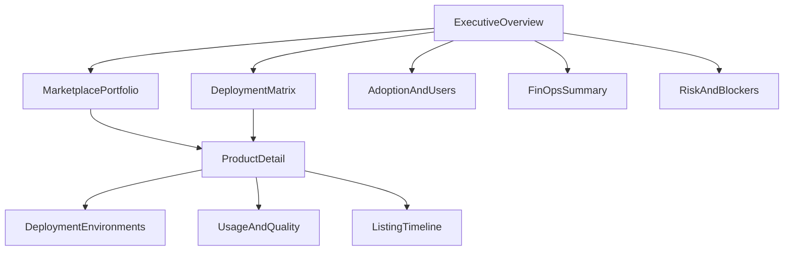
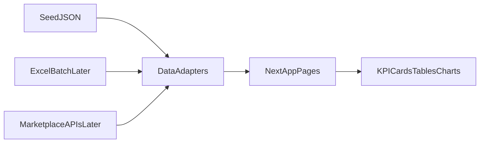

# Marketplace Deployment Status Report Dashboard — PRD & Implementation Plan

**Decisions locked:** Scope = marketplace portfolio + deployment/adoption drill-down (1C). Stack = Next.js + TypeScript + Tailwind with seed data first (2A).

**Meeting context informing this plan:** [Agentic Dashboard](https://notes.granola.ai/d/bcd9f157-1265-4a3a-9a60-81cd4a7cbf14) KPI hierarchy; [Gemini KT / dashboard setup](https://notes.granola.ai/d/74a74bae-3fc2-4b0c-9602-1d9739faf466) 9-product executive view + Nancy log format; [AI Garage StandUp](https://notes.granola.ai/d/5c6cdbcf-8cbb-4cf0-a26f-d0758c632154) Anthropic Marketplace target and multi-cloud partnerships.

---

## 1. Problem & goals

**Problem:** Leadership and product owners lack a single view of which Intuitive products/agents are listed or live on each marketplace (AWS, Azure, GCP, Databricks, Anthropic), whether deployments are healthy, and whether customers/users are actually adopting them. Today status is scattered across Excel exports, dummy dashboard data, and owner updates.

**Goals:**
- One executive surface for marketplace listing + deployment status across all target marketplaces
- Drill-down from marketplace → product → deployment environment → usage/FinOps
- Personas: executive (Jay/Dr.), product owner, marketplace/alliance lead, developer/ops
- Ship a usable MVP with realistic seed data; swap to APIs/Excel batch ingest later without redesigning the UI

**Non-goals (v1):** Live marketplace API sync, billing settlement, customer CRM replacement, full agent debugging traces (those stay in per-agent ops tools).

---

## 2. Personas & primary use cases

| Persona | Jobs to be done |
|---|---|
| Executive | Are we live on the right marketplaces? Adoption and spend healthy? Top risks? |
| Alliance / marketplace lead | Listing pipeline, review blockers, partner-sourced installs |
| Product owner | Per-product status across clouds, users, success rate, cost |
| Ops / FDE | Deployment health, rollbacks, incidents, data freshness |

**Use cases to support:**
1. Portfolio RAG by marketplace (listed / in review / draft / not started / deprecated)
2. Cross-cloud deployment matrix (product × marketplace × status)
3. Adoption: DAU/WAU/MAU, installs, active tenants, requests per user
4. Reliability: success rate, failure rate, uptime, rollbacks, open incidents
5. FinOps: AI/cloud spend per product, cost per successful task, cost anomalies (e.g. Databricks spend spikes)
6. Lifecycle: version, last deploy, deployment frequency, time-to-list
7. Risk board: stalled listings, failing deploys, low adoption, cost overruns — with owner
8. Export / report for ELT demos (filterable table + CSV later)

---

## 3. Information architecture

**Pages (MVP):**
1. `/` — Executive overview (KPI strip + marketplace cards + risk list)
2. `/marketplaces/[slug]` — One marketplace deep dive (listings, installs, blockers)
3. `/products` — Product catalog table with filters
4. `/products/[id]` — Product detail (deployments, users, cost, versions)
5. `/matrix` — Product × marketplace status matrix
6. `/reports` — Deployable “status report” view (print/export-friendly)

---

## 4. Metrics & components (MVP vs later)

### Executive KPI strip (top of home)
- Products live (any marketplace)
- Listings in review / blocked
- Total active users (MAU)
- Deployment health % (success rate weighted)
- AI/marketplace-related spend (MTD)
- Open P0/P1 risks

### Marketplace cards
Per marketplace (AWS, Azure, GCP, Databricks, Anthropic): live count, in-review count, installs/MAU, last status change, health badge.

### Deployment matrix
Rows = products (seed: L&D, BRD, MDA, FinOps, GitHub, Hiring, OpenOps, Intuitive IQ, others aligned to the 9 tracked items). Columns = marketplaces. Cell = status enum + tooltip (version, last deploy).

### Product table columns
Name, owner, marketplaces live, deployment status, success %, MAU, spend MTD, version, last updated, risk flag.

### Product detail sections
- Listing status timeline per marketplace
- Environments: prod / staging / sandbox with health
- Adoption: DAU/WAU/MAU trend, installs, active orgs
- Quality: success rate, escalation rate, error rate
- FinOps: spend trend, cost per successful task
- Catalog metadata: owner, purpose, dependencies (from agent-as-product framing)

### Phase 2+ metrics (designed in, not fully built in MVP)
- Hallucination/groundedness, A2A handoff success, policy violations, hours saved / business value, partner-sourced revenue, time-to-list SLA

**Status model (shared enum):** `not_started` | `draft` | `in_review` | `listed` | `deployed` | `degraded` | `failed` | `deprecated`

---

## 5. Data model (seed-first)

Core entities in TypeScript types + JSON/TS seed under `src/data/`:

- `Marketplace` — id, name, slug, cloud, icon
- `Product` — id, name, owner, category, description, version
- `Listing` — productId, marketplaceId, status, submittedAt, listedAt, listingUrl, blockers[]
- `Deployment` — productId, marketplaceId, env, status, successRate, lastDeployAt, rollbackCount
- `UsageSnapshot` — productId, date, dau, wau, mau, installs, activeTenants, tasksExecuted
- `CostSnapshot` — productId, marketplaceId?, date, amountUsd, costPerSuccess
- `Risk` — id, severity, title, owner, relatedProductId?, relatedMarketplaceId?, status

**Ingest path (post-MVP):** Excel/CSV matching Nancy’s agent log format → normalize into the same schema; later marketplace Partner APIs / CloudWatch / Databricks billing.

---

## 6. Tech architecture

**Greenfield in** `C:\dev\marketplace-dashboard` (currently empty).

- **App:** Next.js (App Router) + TypeScript + Tailwind CSS
- **UI:** Lightweight custom components (tables, KPI cards, badges, simple charts via Recharts); preserve a sober internal-ops look (no purple-gradient AI cliché)
- **Data access:** `src/lib/data.ts` read adapters over seed JSON; swap to API/DB later behind the same functions
- **Auth (phase 2):** stub role views (executive / owner / alliance) — RBAC called out in standup for Intuitive Dashboard; MVP uses a role switcher only
- **Deploy:** static-friendly Vercel or internal host; no auth required for MVP demo

---

## 7. Phased delivery

### Phase 0 — Scaffold (day 1)
- Init Next.js + TS + Tailwind
- Design tokens, layout shell, nav
- Seed data for 5 marketplaces + ~9 products + listings/deployments/usage/costs/risks

### Phase 1 — MVP dashboard (primary ship)
- Executive home with KPIs, marketplace cards, top risks
- Deployment matrix + product list + product detail
- Filters: marketplace, status, owner, time range (7d/30d/MTD)
- Marketplace detail page
- Status report page suitable for ELT walkthrough

### Phase 2 — Adoption & FinOps depth
- Trend charts (users, success rate, spend)
- Cost anomaly highlights
- Role switcher (exec vs owner views)
- CSV export of status report

### Phase 3 — Real data
- Excel/CSV upload or folder watch using Nancy log schema
- Optional AWS/Databricks cost connectors
- Freshness indicators and owner data-quality flags

### Phase 4 — Marketplace sync & alerts
- Partner Center / Marketplace API status where available
- Slack/email alerts on listing stalled > N days or health degraded

---

## 8. Success criteria (MVP)

- Exec can answer in &lt;30s: how many products live per marketplace, which are blocked, top 3 risks
- Product owner can open one product and see listing + deploy health + MAU + spend
- Matrix shows complete product × marketplace coverage with no blank unexplained cells
- Seed data is coherent enough for a live demo (not obviously random)

---

## 9. Deliverables in-repo

After approval and implementation:
- `docs/PRD.md` — full PRD (problem, personas, metrics, IA, exclusives, phases)
- Working Next.js app with Phase 1 pages + seed data
- `README.md` — run instructions and data model overview

---

## 10. Key files to create (implementation)

- `package.json`, `next.config.ts`, `tailwind.config.ts`, `tsconfig.json`
- `src/app/layout.tsx`, `src/app/page.tsx`, `src/app/marketplaces/[slug]/page.tsx`, `src/app/products/page.tsx`, `src/app/products/[id]/page.tsx`, `src/app/matrix/page.tsx`, `src/app/reports/page.tsx`
- `src/data/*.json` or `src/data/seed.ts`
- `src/lib/types.ts`, `src/lib/data.ts`, `src/lib/status.ts`
- `src/components/` — `KpiStrip`, `MarketplaceCard`, `StatusBadge`, `DeploymentMatrix`, `ProductTable`, `RiskList`, `TrendChart`
- `docs/PRD.md`
